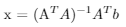

# Model fitting using normal equations

A sample meal data was provided as input, which contained information about the number of bites and calories consumed by 83 different people over time.
The aim of the exercise is to determine the relation between bites and calories each bite contained. The input data can be found in meal_data.mat. The data coloumns are "participant id", "meal id", "number of bites" and "kilocalories consumed".

Two different model fitting has been tried.
1. Exponential Model
2. Circular Model

Solution to normal Equations  

