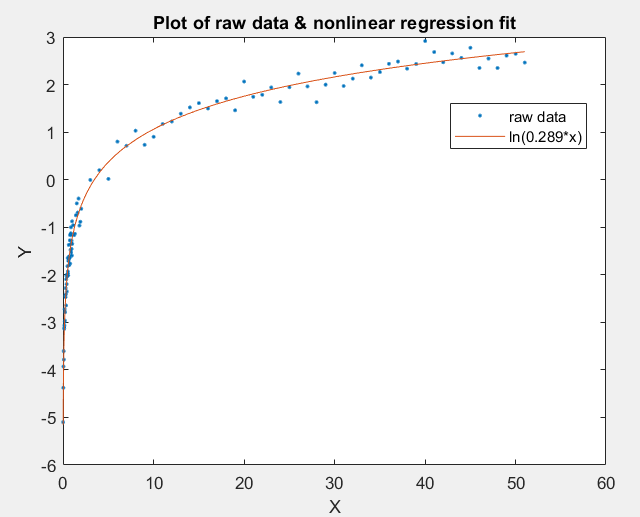

# Nonlinear Regression Fit

Whenever our basis function consists of non linear term then we need to apply nonlinear regression fit , which is an interative method of finding the unknowns in the equation.
The accuracy of the curve fitting depends on the initilization value. Based on the initial value the iterations are carried out thereby moving towards close to true value of the unknown constant in basis function , once the difference between two consecutive iteration goes below threshold the iterations are stopped.

There are 3 datasets provided (data_A, data_B, data_C) for which curve fitting is done. 

y = ln(an * x) 

is taken as nonlinear curve to be fitted to the data where an is the unknown. Root finding approach is used for determination of this unknown.

The first step is to identify the error function which is given by

In this case it becomes,

Indication of arrival at true an value is indicated by magnitude of change in abive error value i.e the derivative of the error function needs to be zero. 
Therefore the derivative of error function is found to be.

Derivative of f(a) is given by

After assuming initial value for an, we arrive at following equation for iteration of the constant.

For every iteration an_new is calculated and when the difference between new an and previous an falls below a threshold then we have reached close to accurate model.
The accuracy and number of iterations depend on the initial value of an.

The program can be run by `lab2.exe dataset.txt`
 dataset needs to replced by actual file name.
 
 The code prints the number of iteration and the final an value.
 
 
 
 `plotter.m` can be used to plot raw data and model curve.
 
 Output for the three datasets are as follows.
 

 

  

 
