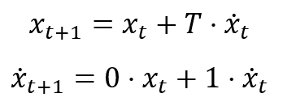
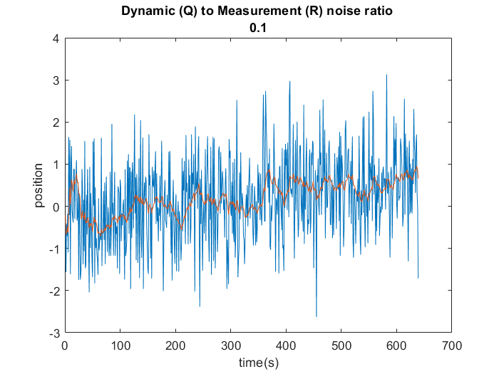
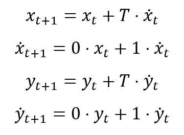
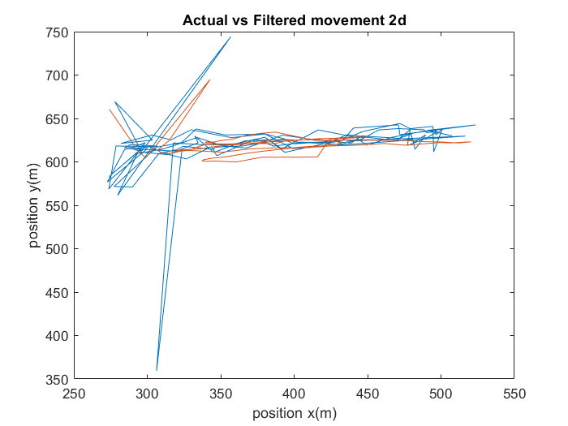
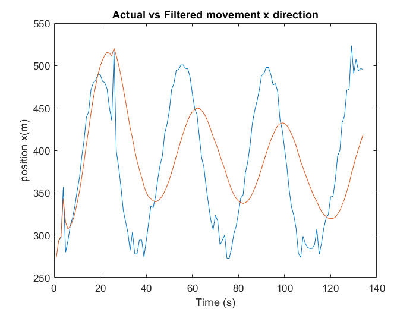
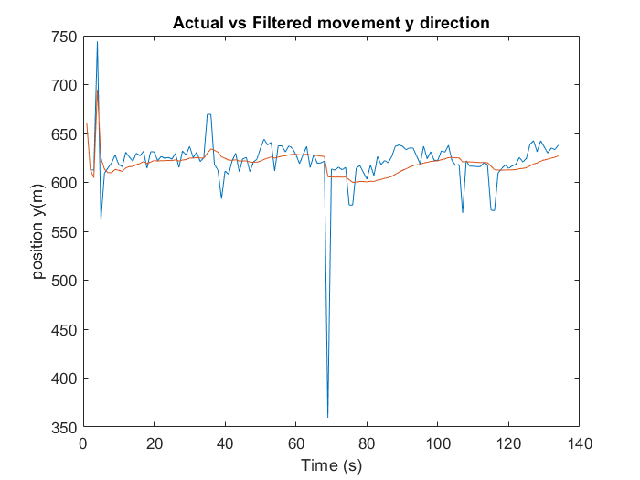

# Kalman Filter

In this project, Kalman filter has been applief for 1d and 2d measurement data. In both the cases constant velocity model has been applied.

The input data can be found in "data.mat". 

## 1d Kalman Filter

The 
This can be found in `1d_KF.m`, this loads the input data and runs 1d Kalman filter to generate the plot of actual and filtered data. 
Three different ratios of dynamic noise (Q) and measurement noise (R) has been tested and as expected as the ratio of dynamic noise to measurement noise increases the filtered data oscillation also increases as the filter trusts measurement more than model of the system.

## 2d Kalman Filter

This can be found in `2d_KF.m`, this loads the input data and runs 2d Kalman filter to generate the plot of actual and filtered data. 

