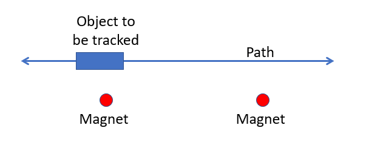
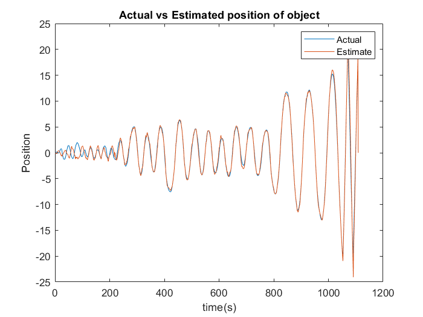
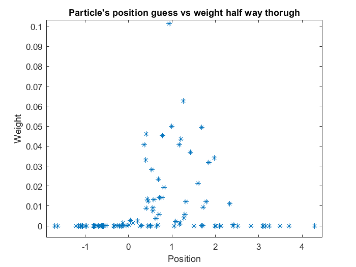

# Particle Filter

Kalman & Extended Kalman filters can be applied when the noise has a normal distribution but when the distribution is non-Gaussian then Particle filter can be applied which is Monte Carlo approximation.

In the current problem an object is moving in a reciprocating fashion in a 1 dimensional path. The path has two magnets positioned on either side of the centerline. The object measures the net field strength exerted by both the magnets.

A particle filter has been implemented to track the position of the object based on the field strength measurement.

