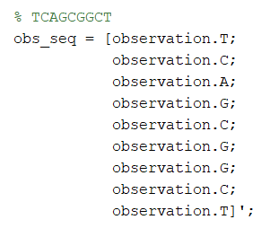
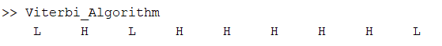

# Viterbi Algorithm

Viterbi algorithm is used here to determine the hidden sequence of states based on the observations.

In this case there are two hidden states (H & L), and the observations are (A, C, G, T). Viterbi algorithm has been implemented which will provide the state sequence for any given observation sequence.

For the above observation the sequence of states are found to be.

